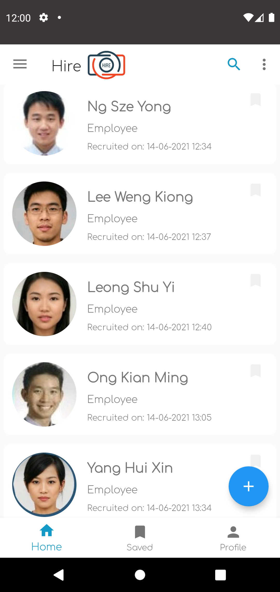
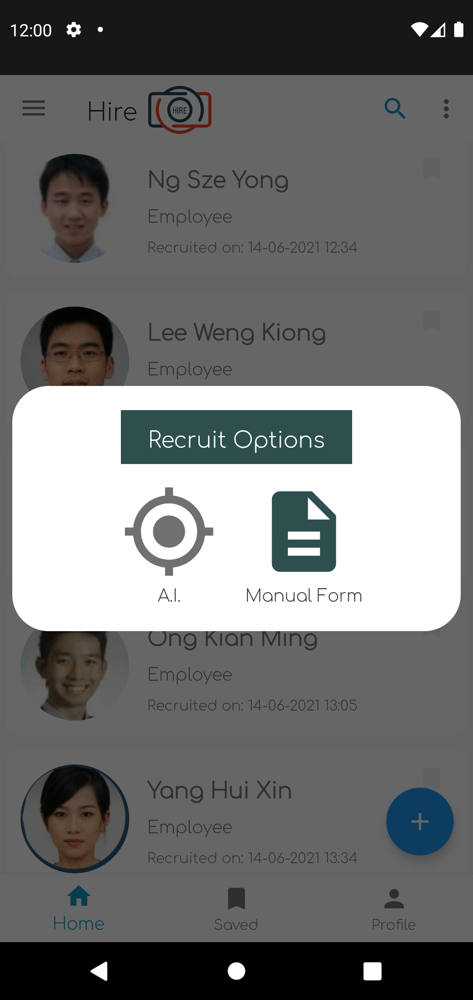
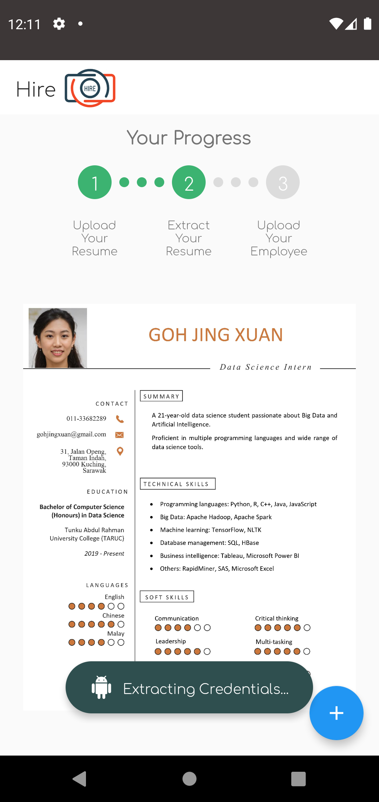
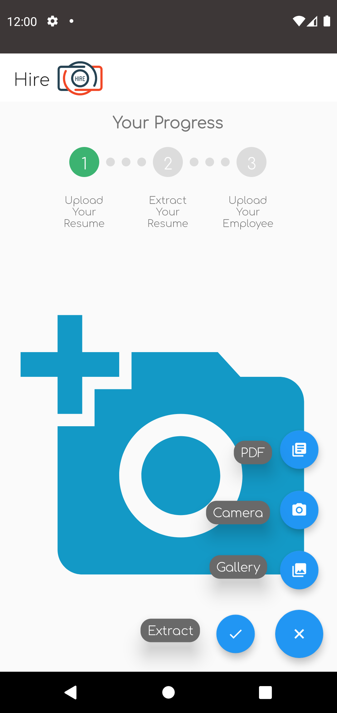
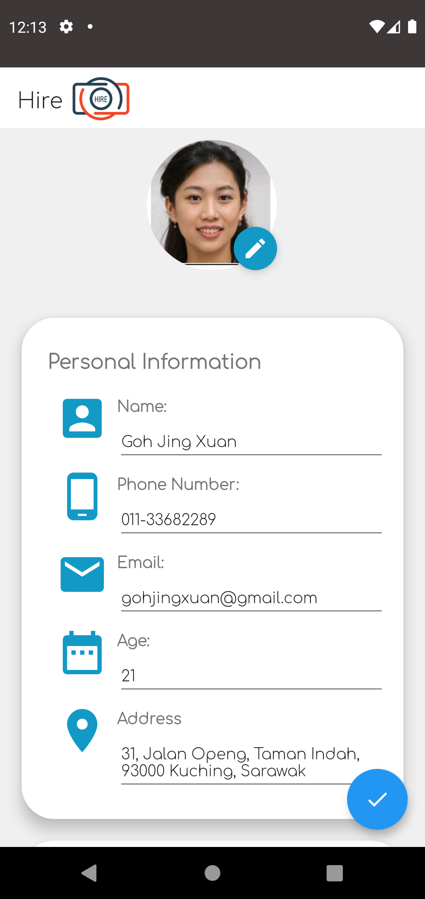
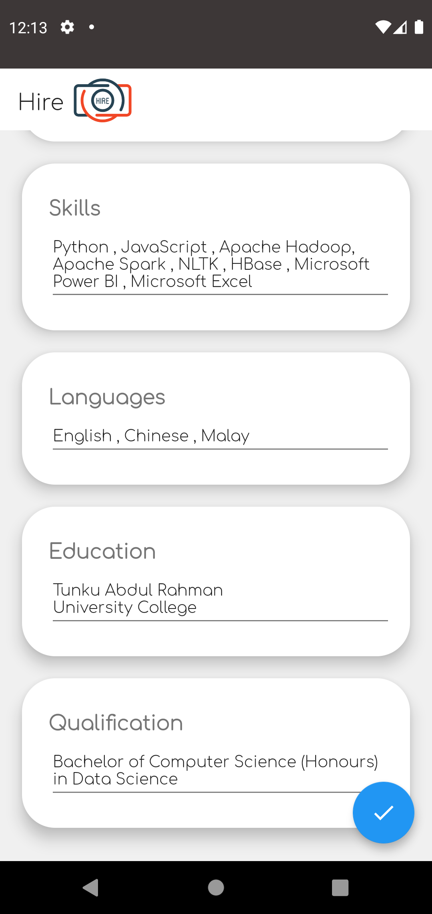
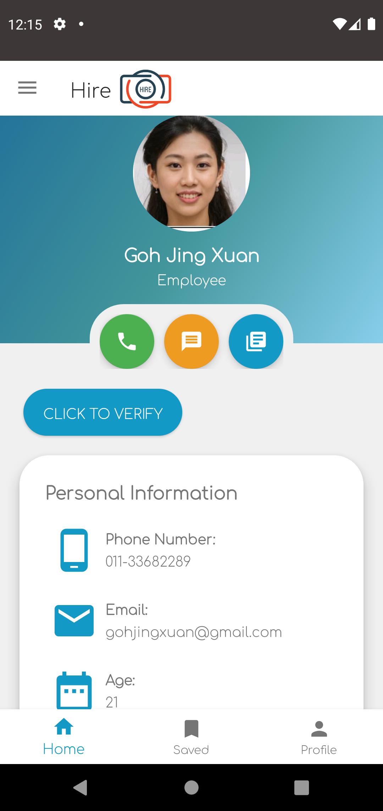

  

  <h3 align="center">Resume Extraction Mobile App</h3>

  

    This mobile application provides employers a solution to extract their newly-hired employees’ information from their resumes, save the information into a database and perform face verification.
  

  
<h3 style="display: inline-block">Table of Contents</h3>

  <ol>
    <li>
      <a href="#about-the-project">About The Project</a>
    </li>
    <li>
      <a href="#demo">Demo</a>
    </li>
    <li>
      <a href="#prerequisite">Prerequisite</a>
    </li>
    <li>
      <a href="#setup">Installation</a>
    </li>
  </ol>

<h3 id="about-the-project">About The Project</h3>

The extraction of employees’ credentials from resumes and data entry have always been
tedious and time-consuming, especially when the number of resumes to be processed for a job
opening is way higher than the number of people assigned to process them (Anaswara &
Aswathy 2019, p. 661). The manual way of extracting and entering the employee’s credentials
is not only inefficient, but also prone to human errors. 
Therefore, this project aims to minimize human efforts in information extraction and data entry.

<b>This project is built with:</b>
 
* [Google ML Kit Face Detection API](https://developers.google.com/ml-kit/vision/face-detection)
* [Google ML Kit Text Recognition API](https://developers.google.com/ml-kit/vision/text-recognition)
* [Stanford CoreNLP](https://stanfordnlp.github.io/CoreNLP/)

<h3 id="demo">Demo</h3>

    
    
This is image 1

    
    
This is image 1

    
    
This is image 1

    
    
This is image 1

    
    
This is image 1

    
    
This is image 1

    
    
This is image 1

<h3 id="prerequisite">Prerequisite</h3>
<ul>
    <li>
      Your mobile device must have an operating system of Android 7.0 or above.
    </li>
</ul>

<h3 id="setup">Installation</h3>
<ul>
    <li>
      The app can be downloaded <a href="https://drive.google.com/file/d/1-UBJwG-iddrUYJ0n-bolY9n5rebUcUbI/view?usp=sharing">here</a>.
    </li>
</ul>
<i>The complete source code is not available yet.</i>
